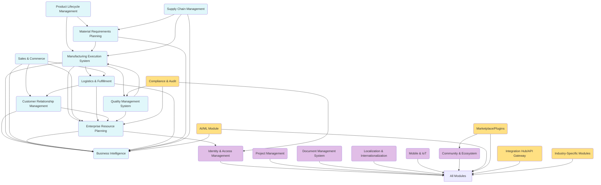

```mermaid
flowchart TD
    PLM(Product Lifecycle Management)
    MRP(Material Requirements Planning)
    SCM(Supply Chain Management)
    MES(Manufacturing Execution System)
    ERP(Enterprise Resource Planning)
    SALES(Sales & Commerce)
    LOGI(Logistics & Fulfillment)
    CRM(Customer Relationship Management)
    BI(Business Intelligence)
    QMS(Quality Management System)
    IAM(Identity & Access Management)
    PM(Project Management)
    DMS(Document Management System)
    MOBILE(Mobile & IoT)
    I18N(Localization & Internationalization)
    COMMUNITY(Community & Ecosystem)
    AI(AI/ML Module)
    COMPL(Compliance & Audit)
    MARKET(Marketplace/Plugins)
    INTHUB(Integration Hub/API Gateway)
    INDUSTRY(Industry-Specific Modules)

    %% Core Flow
    PLM --> MRP
    PLM --> MES
    MRP --> MES
    SCM --> MRP
    SCM --> MES
    MES --> ERP
    MES --> QMS
    MES --> LOGI
    SALES --> ERP
    SALES --> LOGI
    SALES --> CRM
    LOGI --> ERP
    LOGI --> CRM
    CRM --> ERP
    QMS --> ERP
    QMS --> MES
    ERP --> BI
    CRM --> BI
    MES --> BI
    SALES --> BI
    LOGI --> BI
    MRP --> BI
    SCM --> BI

    %% Platform & Cross-cutting
    ERP --> IAM
    IAM --> ALL[All Modules]
    PM --> ALL
    DMS --> ALL
    I18N --> ALL
    MOBILE --> ALL
    COMMUNITY --> ALL

    %% Optional/Advanced
    AI --> BI
    AI --> ALL
    COMPL --> ERP
    COMPL --> QMS
    COMPL --> IAM
    MARKET --> COMMUNITY
    MARKET --> ALL
    INTHUB --> ALL
    INDUSTRY --> ALL

    classDef core fill:#e0f7fa;
    classDef platform fill:#e1bee7;
    classDef optional fill:#ffe082;

    class PLM,MRP,SCM,MES,ERP,SALES,LOGI,CRM,BI,QMS core;
    class IAM,PM,DMS,MOBILE,I18N,COMMUNITY platform;
    class AI,COMPL,MARKET,INTHUB,INDUSTRY optional;
```
- **Blue:** Core business modules  
- **Purple:** Platform/cross-cutting modules  
- **Yellow:** Optional/advanced modules

---